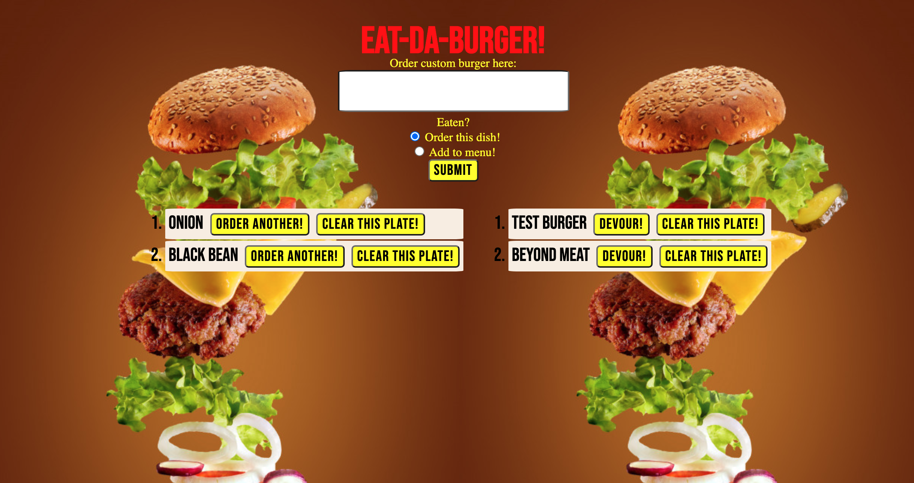

# EAT-DA-BURGER 
    * About
    * Eat-Da-Burger! Is a restaurant app that lets users input the names of burgers they'd like to eat.

# EAT-DA-BURGER uses the following list of example commands:
    * npm install 
        - This installs all required packages from the package.json
    * run schema.sql and seed.sql
        - Before running 'node server.js', create the database through the provided schema.sql and seed.sql files
    * node server.js
        - Running this command opens the server and allows the site to begin operating

# Technologies used:
    * Node.js
    * Express
    * Express Handlebars
    * MySQL

# NPM Packages(REQUIRED):
    * Express
    * Express Handlebars
    * MySQL

# How to Use EAT-DA-BURGER:
*       The application will open with an existing menu on the left. You can click order again if you want something off this menu OR you can order a custum burger in the input field. There is also a feature that adds a new burger to the menu instead of ordering right away. If you devour something on your plate it will return to the menu and if you decide you want something else from the menu you can click "order again". The menu and plate can be cleared if you decide you dont like it or want it on the menu anymore.

\

# Access the app here: 

# Author
    *Karleigh Ponnock

